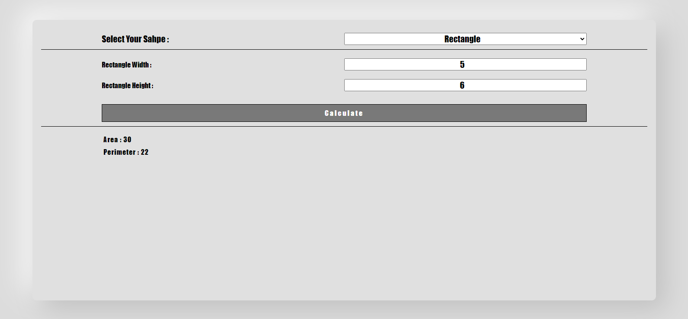

<h1 align="center">Shape Calculator</h1>

Shape Area and Perimeter Calculator with OOP ( inheritance ) in JS

 

<strong>Calculator Has Shapes :</strong>

    <ul>
        <li>Square</li>
        <li>Rectangle</li>
        <li>Circle</li>
    </ul>

<h2></h2>

<a href="https://mre-dev.github.io/shape-calculator/">----- Click To View Demo -----</a>

<h2></h2>

<strong>Features and capabilities : </strong>

    <ul>
        <li>Fully responsive</li>
        <li>Area Calculation</li>
        <li>Perimeter Calculation</li>
    </ul>

<h2></h2>

Screenshot :

    

